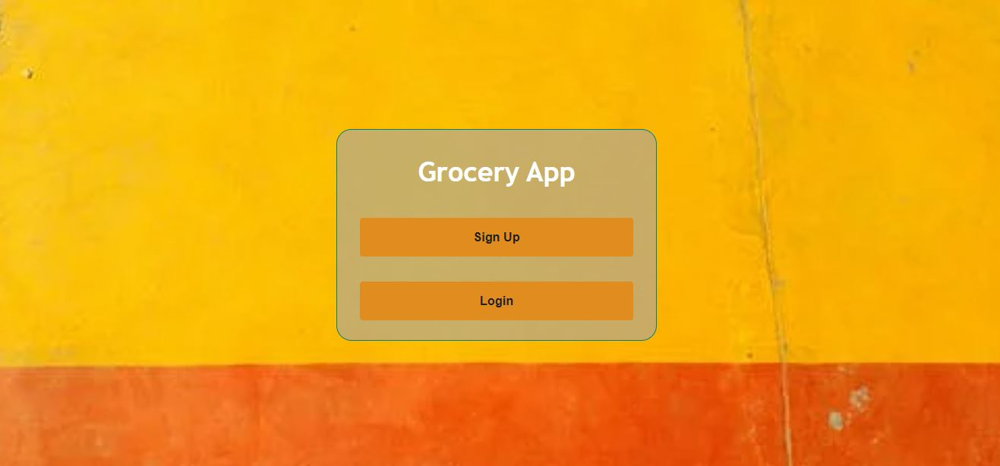
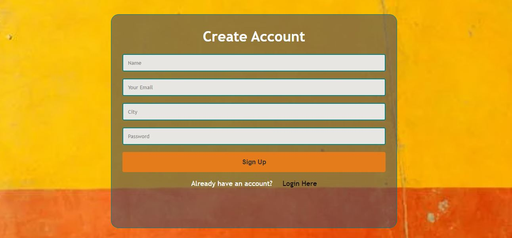
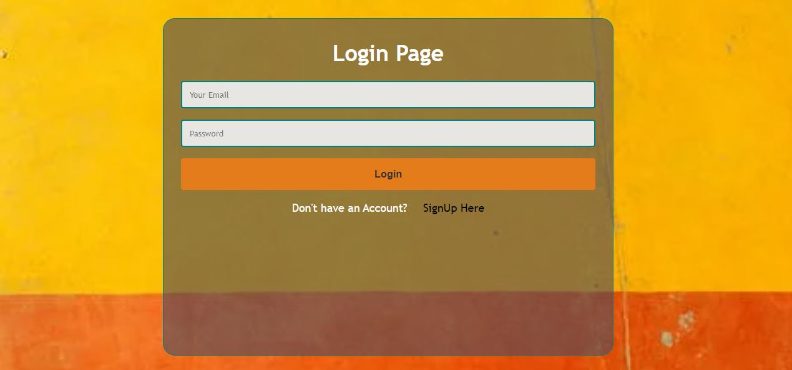

# Grocery List
### Frontend
```
cd client
cd grocery
npm start 

```
### Backend 
```
cd server
npm start

```

## First Screen


## Dont have account? SIGN UP! 


## Have account already? Perfect! Sign In


1. Developed front-end pages using react.js
- - home.js, 
- - signup.js
- - login.js

2. We have made a backend router named 
- - auth.js 
- - 2 router paths named /auth/register and/auth/login.

3. Developed a database named grocery.

4. Connected the front-end with backend using axios dependency.

5. Saved signup data to grocery database which includes
- Name
- Email
- City
- Password

#### Technolgies :
- HTML
- CSS
- JavaScript 
- Node 
- Express 
- Mongodb
- Mongoose
- Auth

#### Contributors 

- Asad Faraz
- Khadija Gardezi
- Masood Akhtar
- Husnain Burki